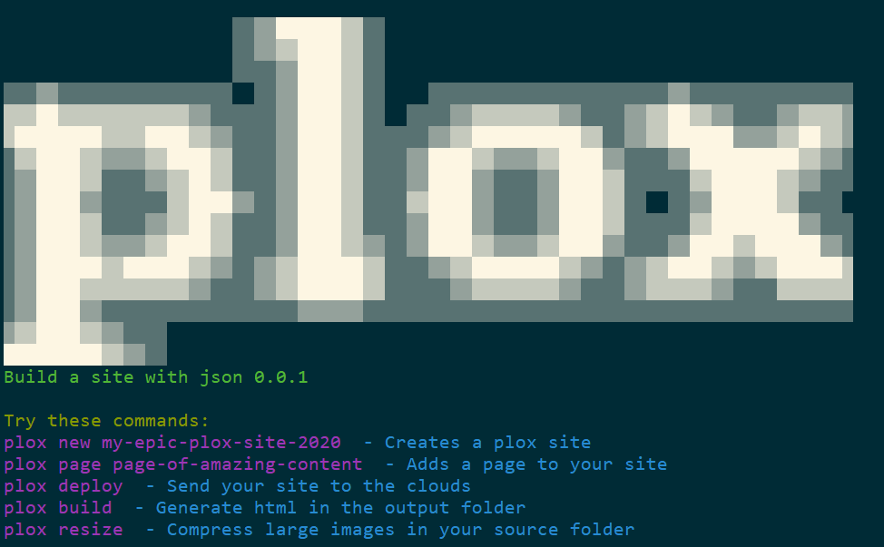

# PLEASE DO NOT USE YET, VERY UNSTABLE/NOT WORKING 🍰
## Markdown driven siteging

[](https://www.npmjs.com/package/plox)
[](https://github.com/leenattress/plox#readme)
[](https://github.com/leenattress/plox/graphs/commit-activity)
[](https://github.com/leenattress/plox/blob/master/LICENSE)
[](https://twitter.com/leenattress)

> Minimal markdown site builder.




### 🏠 [Homepage](https://github.com/leenattress/plox)

## Quickstart

```sh
npm i plox -g
plox new my-fabulous-site
cd my-fabulous-site
plox page my-first-page
plox build
```

## plox.json

In the root of your generated site you will find the `plox.json` file.

Here is the default:

```
{
  "title": "My New Plox Site",
  "theme": "bravest",
  "themeData": {
    "headerOverlayColour": "rgba(59, 48, 84, 0.6)"
  },
  "menu": {
    "Home": "/",
    "Github": "https://github.com/leenattress/plox",
    "NPM": "https://www.npmjs.com/package/plox"
  }
}
```

This file is passed into every page, its a good place to keep global key/values such as settings specific to your site.

## Template language and concepts

plox uses [Nunjucks](https://mozilla.github.io/nunjucks/) for it's templates and you will find only a single file in the theme folder: `page.html`.

This page contains all the necessary logic to create your site. Remember that plox is a minimal site engine, so we deliberately dont get complicated. We want the simplest possible site.

Each JSON in your src folder has some metadata at the top. This is not rendered as part of the page, but rather extracted and available in the Nunjucks template. This is the structure of the data available in the Nunjucks page:

```
"header": {
    "title": "Page Title",
    "author": "Lee Nattress",
    "meta": {
      "og:title": "Page Title",
      "og:type": "website",
      "og:image": "opengraph_image.jpg"
    }
  }
```
- `{{siteConfig}}` is the config, found in `plox.json`

`{{siteConfig}}`, by default contains the title of your site, as well as any data you see fit to put in there.

You can access the data like this: `{{siteConfig.title}}` or `{{siteConfig.author.name}}`.

For more help creating a template in Nunjucks [see here](https://mozilla.github.io/nunjucks/templating.html), or open `page.html` in your favourite editor to take a look at a simple example, with loops and conditional statements in Nunjucks.

## Author

👤 **Lee Nattress <leenattress1981@gmail.com> (http://leenattress.com)**

* Twitter: [@leenattress](https://twitter.com/leenattress)
* Github: [@leenattress](https://github.com/leenattress)

## 🤝 Contributing

Contributions, issues and feature requests are welcome!

Feel free to check [issues page](https://github.com/leenattress/plox/issues).

## Show your support

Give a ⭐️ if this project helped you!


## 📝 License

Copyright © 2019 [Lee Nattress <leenattress1981@gmail.com> (http://leenattress.com)](https://github.com/leenattress).

This project is [ISC](https://github.com/leenattress/plox/blob/master/LICENSE) licensed.

***
_This README was generated with ❤️ by [readme-md-generator](https://github.com/kefranabg/readme-md-generator)_

